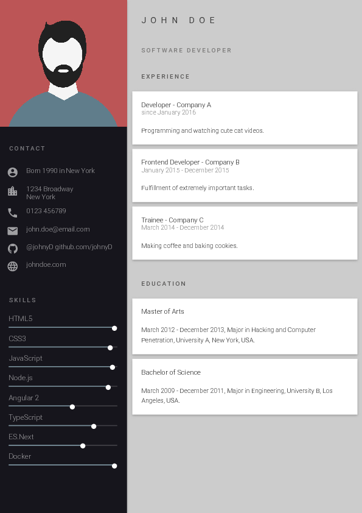
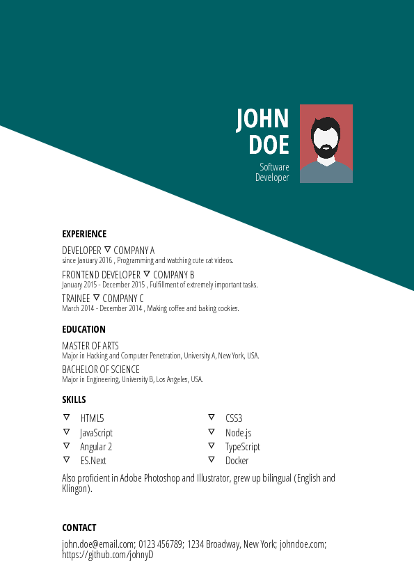

<h1 align="center">
   
  
   
  best-resume-ever
   
</h1>

<h4 align="center">
  :necktie: :briefcase: Build fast :rocket: and easy multiple beautiful resumes and create your best CV ever!
    
  Made with Vue and LESS.
</h4>

 
 

 
 

## How to use

best-resume-ever requires at least node v.8.5.0.

1. Clone this repository.

2. Run `npm install`.

3. Customize your resume in the `resume/` directory: edit your data `data.yml` and replace your profile-picture `id.jpg`.

4. Preview resumes with `npm run dev`.

5. Export with `npm run export`.

All resumes will be exported to the `pdf/` folder.
