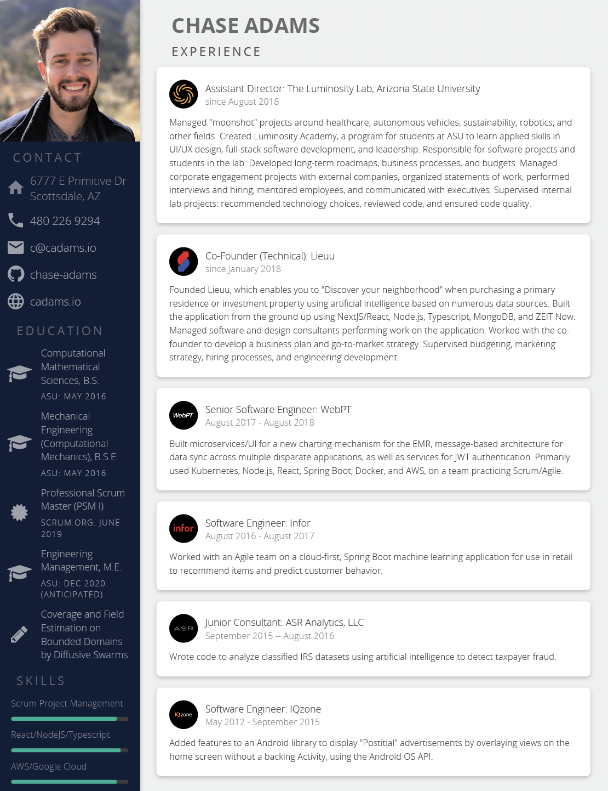

<h1 align="center">
   
  
   
  resume
   
</h1>

<h4 align="center">
  :necktie: This is the code behind a Chase Adams resume!
   
   
  Built from <a href="https://github.com/salomonelli/best-resume-ever">best-resume-ever</a>. Made with Vue and LESS.
</h4>

 
 

 
 

## Usage

1. Clone this repository.

2. Run `yarn install`.

3. Preview resumes with `npm run dev`.

4. Export with `npm run export`.

The resumes and cover letters will be exported to the `pdf/` folder. Check them out!

## License

Licensed under the [MIT license](LICENSE).
